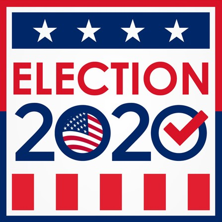

# TP - NLP

## Análisis del impacto del sentimiento de los tweets en su popularidad durante la campaña presidencial estadounidense: una comparación con variables como seguidores, horario de publicación y uso de hashtags.

## Objetivos del trabajo
¿Qué es lo que hace viral a un tweet? 

Este análisis busca entender cuáles factores determinan la popularidad de un tweet durante la campaña presidencial estadounidense del 2020. En particular, se investigan los siguientes elementos:
- Sentimiento del texto del tweet 
- Número de seguidores 
- Horario de publicación 
- Cantidad Hashtags
- Longitud del tweet

## Corpus
El corpus se pude encontrar [aquí](https://www.kaggle.com/datasets/manchunhui/us-election-2020-tweets).

Se usó el subset de tweets que contienen #Trump. Recolectados entre el 15 de octubre y el 8 de noviembre (las elecciones fueron el 3 de noviembre)
Se tienen 971158 entradas (texto, #likes, #seguidores, etc.).

## Requisitos
- Python 3
- GPU Nvidia o GPU AMD con ROCm (suerte configurando eso ;V)

